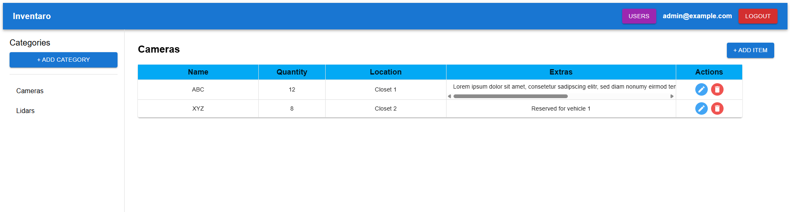
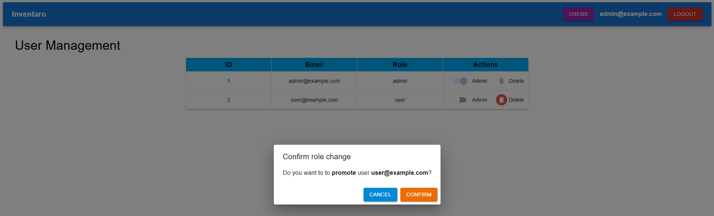

# Inventaro


### Overview
Inventaro is a full-stack inventory Management application built with **FastAPI**, **React**, **PostgreSQL** and **Docker**. It features separated databases for authentication and inventory data,  role-based access control, JWT authentication and refresh token support. Admins can manage users, categories, and items, while regular users have read-only access.


### Features
🔐 JWT authentication and refresh token

👤 User and Admin roles

🧱 Two isolated PostgreSQL databases

  - `auth_db` → user accounts & credentials
  - `inv_db` → categories & items

🛡️ Admin-only management of users, categories, and items

👀 Public read access for categories and items

📦 Docker & Docker Compose setup

🎨 React frontend (Vite + MUI)


### Authorization Model
| Action                      | User  | Admin |
|-----------------------------|:-----:|:-----:|
| Register / Login            |  ✅  |   ✅  |
| View categories & items     |  ✅  |   ✅  |
| Create categories & items   |  ❌  |   ✅  |
| View all users              |  ❌  |   ✅  |


An initial admin user is created automatically on startup using secrets:
  - admin_email
  - admin_password

This allows first access to the system. This initial admin account cannot be deleted.

### Usage
🐳 Docker Setup for Development

#### Backend
```
docker-compose -f docker-compose.dev.yaml up
```

#### Frontend
In another terminal:
```
cd frontend
npm run dev
```

The following screenshot shows the login page. Users who access the application for the first time can register by using their email address and a password.


Items can be created be defining the name, the location, the quantity and extras. Every item can be updated or deleted. The items list page can look like this:




The user management page shows all registered users and their assigned role. Only admins can see this page and only they are allowed to promote a user to an admin or to demote an admin to an user. After a demotion the user will be logged out.


